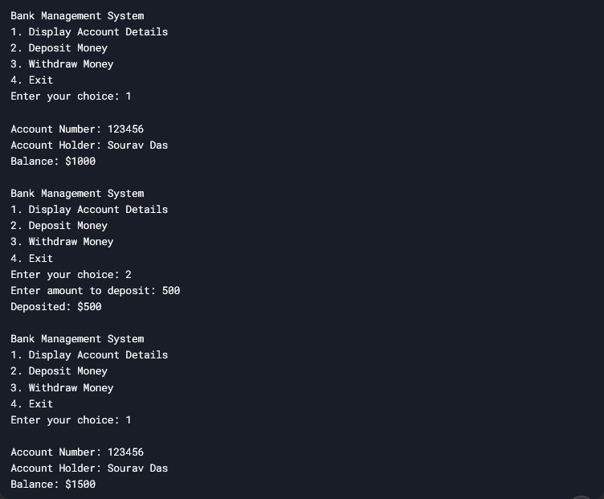

# Bank-Management-System# Bank Management System

This is a simple C++ project for managing bank accounts. It allows users to:
- Create an account.
- Deposit money.
- Withdraw money.
- View account details.

---

## How to Run

### **Using CLion**
1. **Open the Project**:
   - Open CLion and select `Open` from the welcome screen.
   - Navigate to the project directory and select the `CMakeLists.txt` file.

2. **Build the Project**:
   - Click the **Build** button (hammer icon) or go to `Build > Build Project`.

3. **Run the Project**:
   - Click the **Run** button (green play icon) or go to `Run > Run 'BankManagementSystem'`.

---

### **Using VS Code**
1. **Install Extensions**:
   - Install the **C/C++** extension from the VS Code marketplace.
   - Install the **CMake Tools** extension if you want to use CMake for building.

2. **Open the Project**:
   - Open the project folder in VS Code (`File > Open Folder`).

3. **Configure CMake (Optional)**:
   - If using CMake, open the Command Palette (`Ctrl+Shift+P`) and select `CMake: Configure`.
   - Select your preferred compiler (e.g., GCC, Clang).

4. **Build the Project**:
   - Open the terminal in VS Code (`Ctrl+``).
   - Run the following commands:
     ```bash
     mkdir build
     cd build
     cmake ..
     make
     ```

5. **Run the Project**:
   - After building, run the executable:
     ```bash
     ./BankManagementSystem
     ```

---



## Project Structure
- `CMakeLists.txt`: CMake configuration file.
- `include/`: Contains header files (e.g., `BankAccount.h`).
- `src/`: Contains source files (e.g., `BankAccount.cpp`, `main.cpp`).

---

## Contributing
Feel free to contribute to this project by opening issues or submitting pull requests.

---
